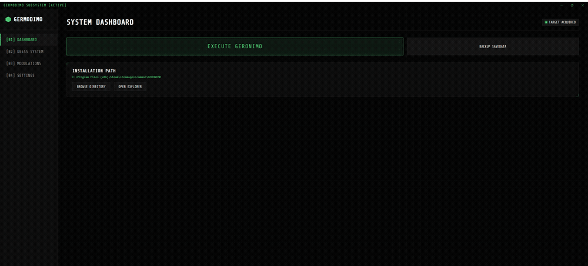
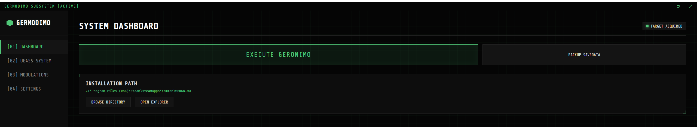
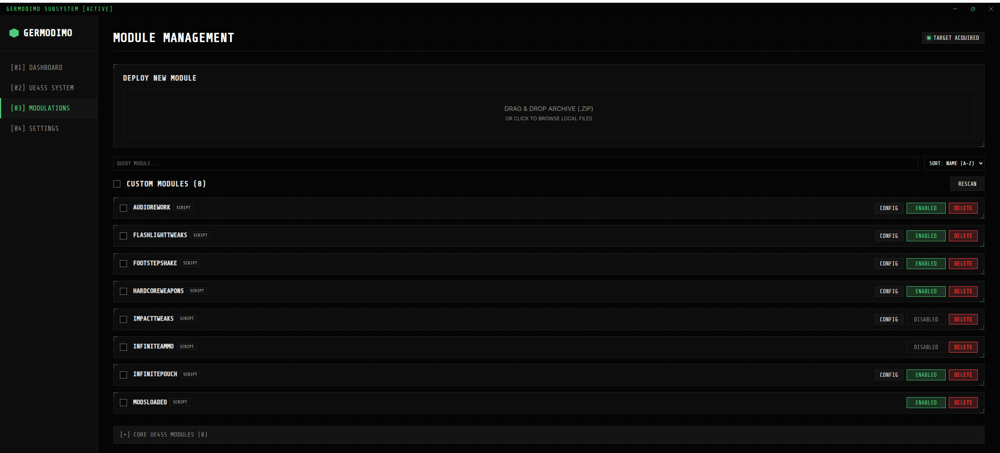
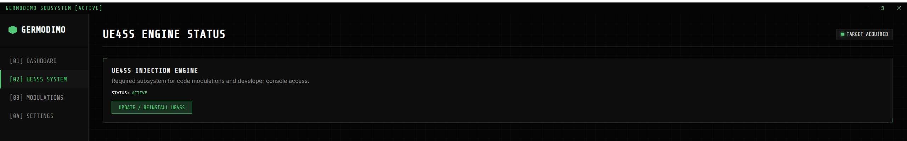
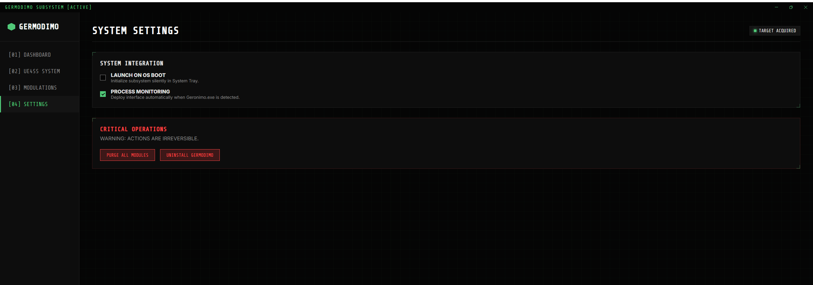

# GerMODimo

<p align="center">
  <a href="https://www.nexusmods.com/geronimo/mods/6"></a>
  
</p>

A desktop mod manager for **Geronimo** (VR tactical shooter, Unreal Engine 5.7). GerMODimo sets up
the UE4SS scripting runtime the game requires and lets you install, enable, configure, and remove
mods from a single window.

> This is an unofficial, community-made tool. It is **not affiliated with or endorsed by** the
> developers or publisher of Geronimo. See [DISCLAIMER.md](DISCLAIMER.md).



---

## Screenshots

| Dashboard | Modulations |
|-----------|-------------|
|  |  |
| **UE4SS System** | **Settings** |
|  |  |

---

## Download

**[Download the latest installer](https://github.com/Krisz223/germodimo/releases/latest)**, then run
`GerMODimo Setup 1.0.0.exe`.

Because the installer is not code-signed, Windows SmartScreen may show a warning — select
**More info → Run anyway** to continue.

Mods are available separately: **[geronimo-mods](https://github.com/Krisz223/geronimo-mods)**.

## Requirements

- A legal copy of **Geronimo** on Steam.
- Windows 10 or 11.

---

## Features

- **Game detection** — locates your Geronimo install automatically, or lets you select it manually.
- **UE4SS installer** — downloads and installs the scripting runtime the game needs, including the
  UE 5.7 signatures required by this build. All components are fetched from their official sources.
- **Mod management** — install by drag-and-drop, enable/disable, remove, and set load order.
- **Live configuration** — edit each mod's settings with sliders, a colour picker, and a
  *Reset to Default* button; changes apply in-game within about a second.
- **Save-data backup** — makes a timestamped copy of your Geronimo save games (gun loadouts, kits,
  outfits, and patches). Recommended before installing or experimenting with mods.
- **Launch / stop the game** and optional startup + process monitoring.

---

## Usage

1. Install and open GerMODimo.
2. On the dashboard, confirm the game path (or browse to it).
3. Open the **UE4SS** tab and install the runtime.
4. On the **Modulations** tab, drag in mods and enable them. Both `.zip` archives and raw pak
   files (`.pak` / `.ucas` / `.utoc`) can be dropped straight in.
5. Launch the game.

Script mods install to `…\GERONIMO\Geronimo\Binaries\Win64\ue4ss\Mods\`; pak mods install to
`…\Geronimo\Content\Paks\Mods\`. Modern IoStore pak mods come as a `.pak` + `.ucas` + `.utoc`
set — GerMODimo handles all three as one mod, so enabling, disabling, and removing keeps them
together.

You can change the colour theme and layout density under **Settings → Appearance**.

---

## Building from source

Intended for developers. Most users should use the [installer](https://github.com/Krisz223/germodimo/releases/latest).

Requires Node.js version 18 or newer.

```bash
cd frontend
npm install
npm run dev      # run in development
npm run build    # produce a packaged installer in frontend/release/
```

---

## License

Original code is released under the [MIT License](LICENSE). *Geronimo* and all related trademarks
are the property of their respective owners.
